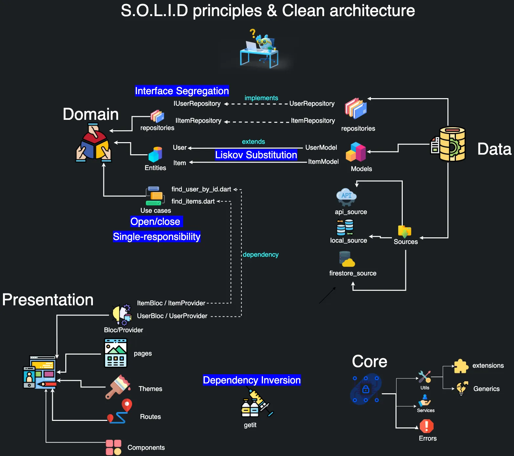
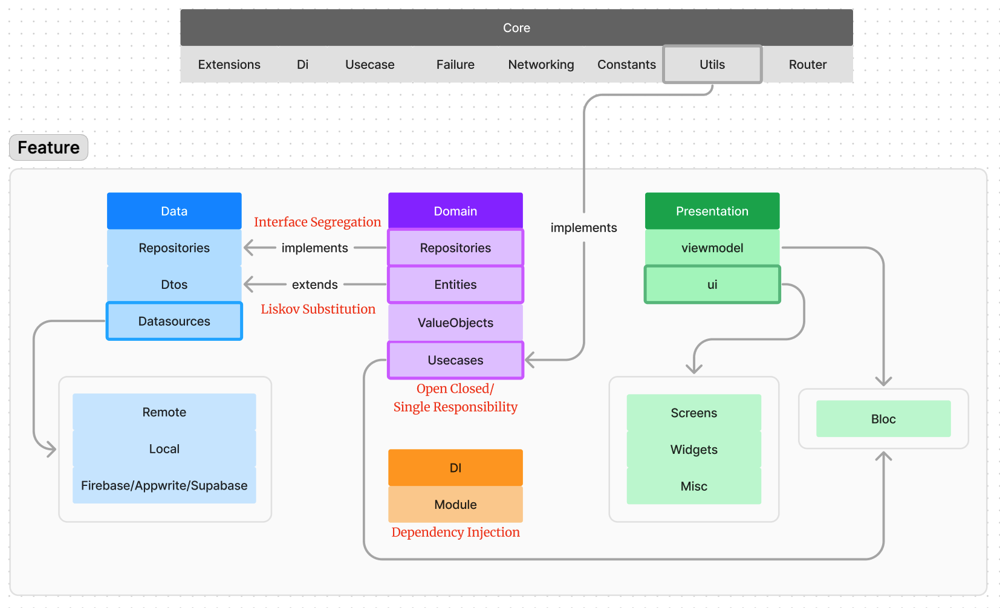

## SOLID Principle overview

## My Custom Structure overview

To start a new feature very first we've do as follows

### Domain Layer

1. **Create the `Entity`**.
   Ex - You're working on a feature of Student
   then the attribute(property) such as, id,name,session,dept
   these are the main properties we want to show in our UI.

   _Check on `domain/entity/user.dart`_

2. Create the Abstract/Interface of repository.

   _Check on `domain/repository/user_repository.dart`_

3. Create `Value Object` if needed
